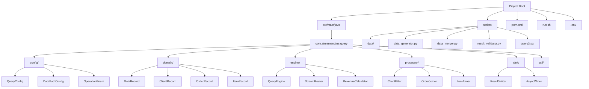
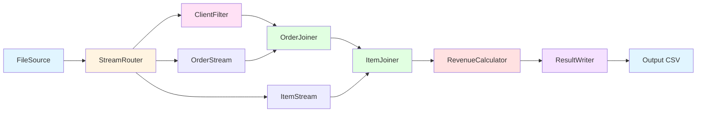

# Stream Query Engine

A real-time stream processing query engine built on Apache Flink, implementing TPC-H Query 3 for streaming data processing.

## Overview

This project implements a streaming version of TPC-H Query 3 using Apache Flink. It processes incremental data updates (INSERT/DELETE operations) and performs real-time revenue aggregation for customers in the AUTOMOBILE market segment.

## Environment Requirements

- **JDK 8+**
- **Maven 3.6+**
- **Python 3.9+**
- **DuckDB** (installed via pip)

## Project Structure



## Core Algorithm Flow



**Processing Steps:**
1. **StreamRouter**: Splits input stream into customer, order, and lineitem streams
2. **ClientFilter**: Filters customers by market segment (AUTOMOBILE)
3. **OrderJoiner**: Joins filtered customers with orders using keyed state
4. **ItemJoiner**: Joins orders with lineitems, filters by ship date threshold
5. **RevenueCalculator**: Aggregates revenue incrementally (handles INSERT/DELETE)
6. **ResultWriter**: Outputs final results to CSV file

## Quick Start

### One-Command Launch

```bash
./run.sh
```

The script automatically:
1. Sets up Python virtual environment
2. Generates TPC-H test data (default ~20MB)
3. Compiles Java project with Maven
4. Runs Flink streaming job
5. Validates results against SQL query

### Custom Data Size

```bash
./run.sh 0.05  # Generate ~50MB data
```

### Output

Results are written to `scripts/data/output.csv`:
```
l_orderkey, o_orderdate, o_shippriority, revenue
48899, 1995-01-19, 0, 13272.0672
...
```
